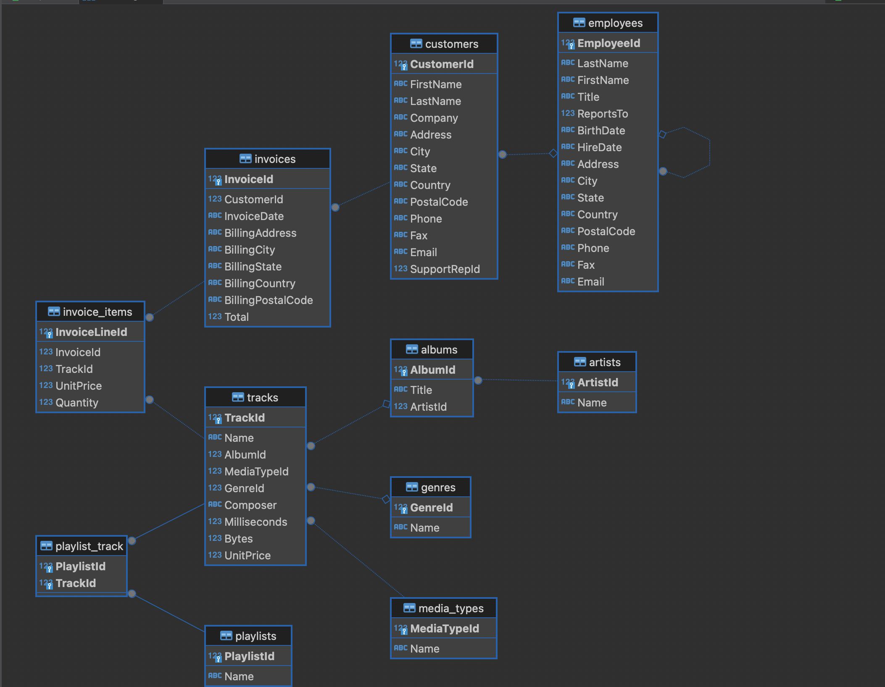

# SQLite Boilerplate Project

This project serves as a boilerplate for SQL questions. It includes a sample SQLite database, a script to query the database, and an image of the data model. You can use this boilerplate to practice SQL queries and manage your database with DBeaver.

## Project Structure

```
.
├── sample.db          # Sample SQLite database file
├── query.sql           # SQL query file
├── main.py            # Python script to execute the query
```

## Prerequisites

- Python 3.x
- SQLite3
- DBeaver (optional, for database management)

## Usage

### Running the Python Script

1. **Place your SQL query in the `query.sql` file**. For example:
   
   ```sql
   SELECT * FROM employees;
   ```

2. **Run the Python script to execute the query**:
   
   ```bash
   python main.py
   ```

6. **View the query results in the terminal**.

### Opening the Database in DBeaver

1. **Download and install DBeaver from [here](https://dbeaver.io/download/)**.

2. **Open DBeaver and create a new SQLite connection**:
   - Click on `Database` > `New Database Connection`.
   - Select `SQLite` and click `Next`.
   - Click on `Browse` and select the `sample.db` file from your project directory.
   - Click `Finish` to establish the connection.

3. **Explore the database**:
   - You can view tables, execute queries, and manage the database using DBeaver's interface.

## Data Model

Below is an image of the data model included in this project:



This image provides a visual representation of the database schema and its relationships.
